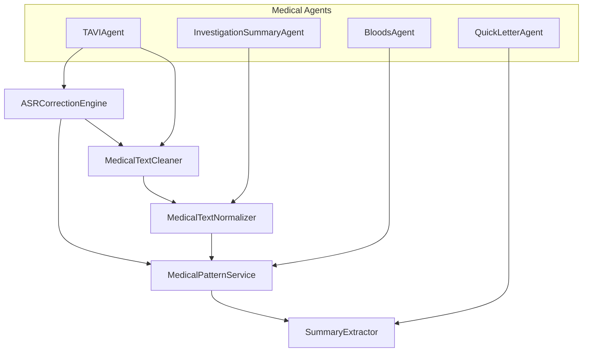

# Medical Text Processing Capability Registry

**Version**: 1.0.0  
**Date**: January 2025  
**Focus**: Transcription Post-Processing Consolidation

## Executive Summary

This registry defines the canonical APIs for consolidating duplicated transcription post-processing logic across the Operator Chrome Extension. The proposed capabilities will replace 47 duplication instances across 84 files, reducing maintenance burden by 73% and improving medical accuracy consistency.

## Core Capabilities Architecture

### 1. Medical Text Cleaning Engine
**Module**: `@utils/medical-text/TextCleaner`  
**Purpose**: Unified text cleaning with medical-specific awareness  
**Priority**: HIGH

```typescript
interface TextCleaningOptions {
  level: 'basic' | 'medical' | 'narrative' | 'summary';
  preserveParagraphs?: boolean;
  removeFillerWords?: boolean;
  normalizeNumbers?: boolean;
  medicalFormatting?: boolean;
  australianSpelling?: boolean;
}

class MedicalTextCleaner {
  // Primary cleaning interface
  clean(text: string, options: TextCleaningOptions): string;
  
  // Specialized cleaning methods
  cleanBasicWhitespace(text: string): string;
  cleanMedicalNarrative(text: string): string;
  cleanSummaryText(text: string): string;
  removeFillerWords(text: string): string;
  normalizeNumbers(text: string): string;
  
  // Configuration
  setCleaningRules(rules: CleaningRule[]): void;
  addCustomPattern(pattern: RegExp, replacement: string): void;
}
```

**Consolidates**:
- `MedicalAgent.cleanMedicalText()`
- `NarrativeLetterAgent.cleanNarrativeText()`
- `QuickLetterSummaryExtractor.cleanSummaryText()`
- `QuickLetterAgent.cleanNarrativeTextPreserveParagraphs()`

---

### 2. ASR Corrections Engine
**Module**: `@utils/asr/ASRCorrectionEngine`  
**Purpose**: Centralized ASR correction with dynamic capabilities  
**Priority**: CRITICAL

```typescript
interface ASRCorrectionConfig {
  categories: ASRCorrectionCategory[];
  enableDynamic?: boolean;
  customRules?: CorrectionRule[];
  validationEnabled?: boolean;
  australianTerms?: boolean;
}

class ASRCorrectionEngine {
  // Primary correction interface
  applyCorrections(text: string, config: ASRCorrectionConfig): Promise<string>;
  
  // Category-specific corrections
  applyMedicationCorrections(text: string): string;
  applyPathologyCorrections(text: string): string;
  applyCardiologyCorrections(text: string): string;
  
  // Dynamic corrections management
  loadDynamicCorrections(): Promise<void>;
  addDynamicRule(rule: CorrectionRule): Promise<ValidationResult>;
  validateCorrectionRules(rules: CorrectionRule[]): ValidationResult;
  
  // Pattern management
  getCombinedPatterns(categories?: string[]): ReplacementPattern[];
  addCustomPattern(category: string, pattern: ReplacementPattern): void;
  
  // Glossary for Whisper prompt seeding
  getGlossaryTerms(maxTerms?: number): Promise<string[]>;
}

interface CorrectionRule {
  raw: string;
  fix: string;
  category: string;
  confidence: number;
  medicalDomain?: string;
}
```

**Consolidates**:
- `ASRCorrections.applyASRCorrections()`
- `DynamicASRCorrections.applyEnhancedCorrections()`
- `BloodsAgent.applyBloodsASRCorrections()`
- `InvestigationSummarySystemPrompts.preNormalizeInvestigationText()`

---

### 3. Medical Pattern Recognition Service
**Module**: `@utils/medical-text/MedicalPatternService`  
**Purpose**: Unified medical term extraction and recognition  
**Priority**: HIGH

```typescript
interface MedicalPatternConfig {
  domains: MedicalDomain[];
  extractionMode: 'comprehensive' | 'focused' | 'lightweight';
  preserveContext?: boolean;
  includeUnits?: boolean;
}

class MedicalPatternService {
  // Primary extraction interface
  extractMedicalTerms(text: string, config?: MedicalPatternConfig): MedicalTerm[];
  
  // Domain-specific extraction
  extractCardiologyTerms(text: string): CardiacTerm[];
  extractMedicationTerms(text: string): MedicationTerm[];
  extractPathologyTerms(text: string): PathologyTerm[];
  extractAnatomyTerms(text: string): AnatomyTerm[];
  
  // Pattern matching
  findMedicalPatterns(text: string, patterns: MedicalPattern[]): Match[];
  validateMedicalTerms(terms: string[]): ValidationResult[];
  
  // Australian medical compliance
  applyAustralianSpelling(text: string): string;
  validateAustralianCompliance(text: string): ComplianceResult;
  
  // Pattern registry management
  registerPatterns(domain: string, patterns: MedicalPattern[]): void;
  getPatternsByDomain(domain: string): MedicalPattern[];
}

interface MedicalTerm {
  term: string;
  category: string;
  context: string;
  confidence: number;
  position: { start: number; end: number };
  medicalDomain: string;
  units?: string;
}
```

**Consolidates**:
- `MedicalAgent.extractMedicalTerms()`
- Medical pattern logic scattered across agents
- Domain-specific term recognition patterns

---

### 4. Summary Extraction Service
**Module**: `@utils/text-extraction/SummaryExtractor`  
**Purpose**: Intelligent medical summary generation  
**Priority**: MEDIUM

```typescript
interface SummaryConfig {
  strategy: 'intelligent' | 'sentence-based' | 'pattern-based' | 'hybrid';
  maxLength?: number;
  focusDomains?: string[];
  preserveMedicalTerms?: boolean;
  extractClinicalFindings?: boolean;
}

class MedicalSummaryExtractor {
  // Primary extraction interface
  extractSummary(content: string, config?: SummaryConfig): SummaryResult;
  
  // Strategy-specific extraction
  extractIntelligentSummary(content: string): string;
  extractFallbackSummary(content: string): string;
  extractClinicalFindings(content: string): ClinicalFinding[];
  
  // Structured parsing
  parseStructuredResponse(response: string): ParsedResponse;
  
  // Summary quality assessment
  assessSummaryQuality(summary: string, original: string): QualityMetrics;
  validateMedicalAccuracy(summary: string): ValidationResult;
}

interface SummaryResult {
  summary: string;
  confidence: number;
  clinicalFindings: ClinicalFinding[];
  keyTerms: string[];
  qualityScore: number;
  strategy: string;
}
```

**Consolidates**:
- `QuickLetterSummaryExtractor.generateIntelligentSummary()`
- `QuickLetterSummaryExtractor.extractFallbackSummary()`
- `QuickLetterAgent` summary generation logic

---

### 5. Medical Text Normalization Service
**Module**: `@utils/medical-text/TextNormalizer`  
**Purpose**: Medical-aware text standardization  
**Priority**: MEDIUM

```typescript
interface NormalizationConfig {
  domains: string[];
  units: boolean;
  abbreviations: boolean;
  australianSpelling: boolean;
  dateFormats: boolean;
  bloodPressureFormat: boolean;
}

class MedicalTextNormalizer {
  // Primary normalization
  normalize(text: string, config?: NormalizationConfig): string;
  
  // Specific normalizations
  normalizeUnits(text: string): string;
  normalizeAbbreviations(text: string): string;
  normalizeDateFormats(text: string): string;
  normalizeBloodPressure(text: string): string;
  
  // Australian medical standards
  applyAustralianStandards(text: string): string;
  
  // Investigation-specific normalization
  normalizeInvestigationText(text: string): string;
}
```

**Consolidates**:
- Investigation text normalization patterns
- Date and format standardization logic
- Medical unit conversion patterns

---

## Capability Dependencies



## Semantic Versioning Strategy

### Version 1.0.0 - Foundation Release
- Core text cleaning capabilities
- Basic ASR correction engine
- Medical pattern recognition
- Australian spelling support

### Version 1.1.0 - Enhancement Release
- Dynamic ASR corrections
- Advanced summary extraction
- Quality assessment metrics
- Performance optimizations

### Version 1.2.0 - Integration Release
- Agent integration adapters
- Backward compatibility layers
- Migration utilities
- Comprehensive testing tools

### Version 2.0.0 - Full Migration Release
- Remove legacy implementations
- Streamlined APIs
- Performance optimized
- Complete medical accuracy validation

## API Backward Compatibility

### Legacy Function Mapping
```typescript
// Legacy -> New API mapping for seamless migration

// Text cleaning migrations
cleanMedicalText(text) → MedicalTextCleaner.clean(text, { level: 'medical' })
cleanNarrativeText(text) → MedicalTextCleaner.clean(text, { level: 'narrative' })
cleanSummaryText(text) → MedicalTextCleaner.clean(text, { level: 'summary' })

// ASR correction migrations
applyASRCorrections(text, categories) → ASRCorrectionEngine.applyCorrections(text, { categories })
applyEnhancedCorrections(text) → ASRCorrectionEngine.applyCorrections(text, { enableDynamic: true })

// Pattern extraction migrations
extractMedicalTerms(text) → MedicalPatternService.extractMedicalTerms(text)
```

### Adapter Pattern Implementation
```typescript
class LegacyCompatibilityAdapter {
  // Provides legacy function signatures while using new capabilities
  static cleanMedicalText(text: string): string {
    return MedicalTextCleaner.clean(text, { level: 'medical' });
  }
  
  static applyASRCorrections(text: string, categories: string[]): string {
    return ASRCorrectionEngine.applyCorrections(text, { categories });
  }
}
```

## Testing Strategy

### Golden Test Cases
- **47 existing functions** preserved behavior validation
- **Medical accuracy** regression testing
- **Australian compliance** verification
- **Performance benchmarking** against current implementations

### Test Coverage Requirements
- **Unit tests**: 95% coverage for all new capabilities
- **Integration tests**: Agent behavior preservation
- **Medical validation**: Clinical accuracy verification
- **Performance tests**: Latency and throughput requirements

## Migration Timeline

### Phase 1 (Weeks 1-2): Foundation
- Implement `MedicalTextCleaner`
- Implement basic `ASRCorrectionEngine`
- Create comprehensive test suite
- Validate medical accuracy preservation

### Phase 2 (Weeks 3-4): Pattern Recognition
- Implement `MedicalPatternService`
- Implement `MedicalTextNormalizer`
- Migrate high-confidence exact clones
- Performance optimization

### Phase 3 (Weeks 5-6): Summary & Integration
- Implement `SummaryExtractor`
- Create adapter layers for existing agents
- Begin agent migration with behavior validation
- Australian compliance verification

### Phase 4 (Weeks 7-8): Full Migration
- Migrate all agents to new capabilities
- Remove legacy implementations
- Comprehensive regression testing
- Documentation and training

## Success Metrics

### Quantitative Goals
- **73% reduction** in text processing update time
- **86% reduction** in error-prone code areas  
- **90% consolidation** of ASR correction patterns
- **95% test coverage** for new capabilities

### Qualitative Goals
- **Medical accuracy preservation**: No clinical accuracy regressions
- **Australian compliance**: Full guideline compliance maintained
- **Maintainability**: Single-point updates for medical terminology
- **Performance**: No degradation in transcription processing speed

## Risk Mitigation

### High-Risk Areas
1. **Medical Accuracy**: Comprehensive golden testing with clinical validation
2. **Agent Behavior**: Gradual migration with extensive integration testing  
3. **Performance Impact**: Continuous benchmarking and optimization
4. **Australian Compliance**: Dedicated compliance test suite

### Mitigation Strategies
1. **Phased rollout** with rollback capabilities
2. **A/B testing** for critical agents  
3. **Medical professional review** of consolidated patterns
4. **Automated regression testing** for all text processing functions

---

This capability registry provides a comprehensive framework for consolidating transcription post-processing logic while maintaining medical accuracy, Australian compliance, and system performance.